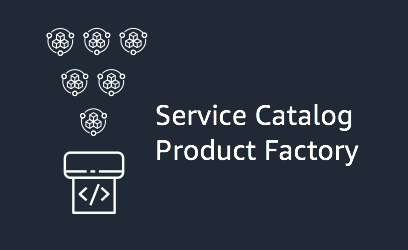

## servicecatalog-factory

 

This is a framework where you define a Service Catalog portfolio, products and versions using YAML. For versions of your 
products you specify where the source code for them can be found and the framework publishes the portfolio, products and 
versions in every* AWS Region after validating, linting and testing them.

Read the docs here: https://aws-service-catalog-factory.readthedocs.io/en/latest/

## License

This library is licensed under the Apache 2.0 License. 
